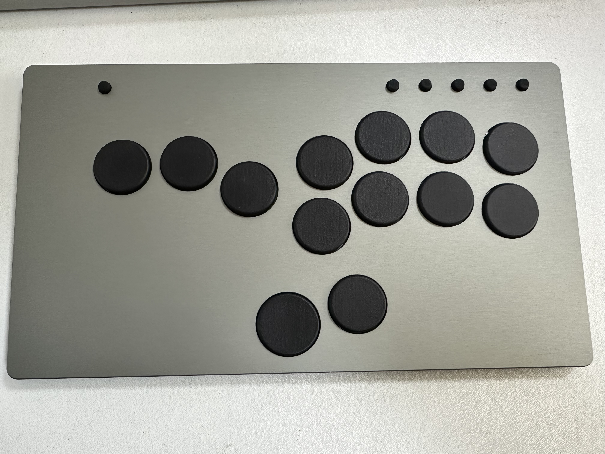
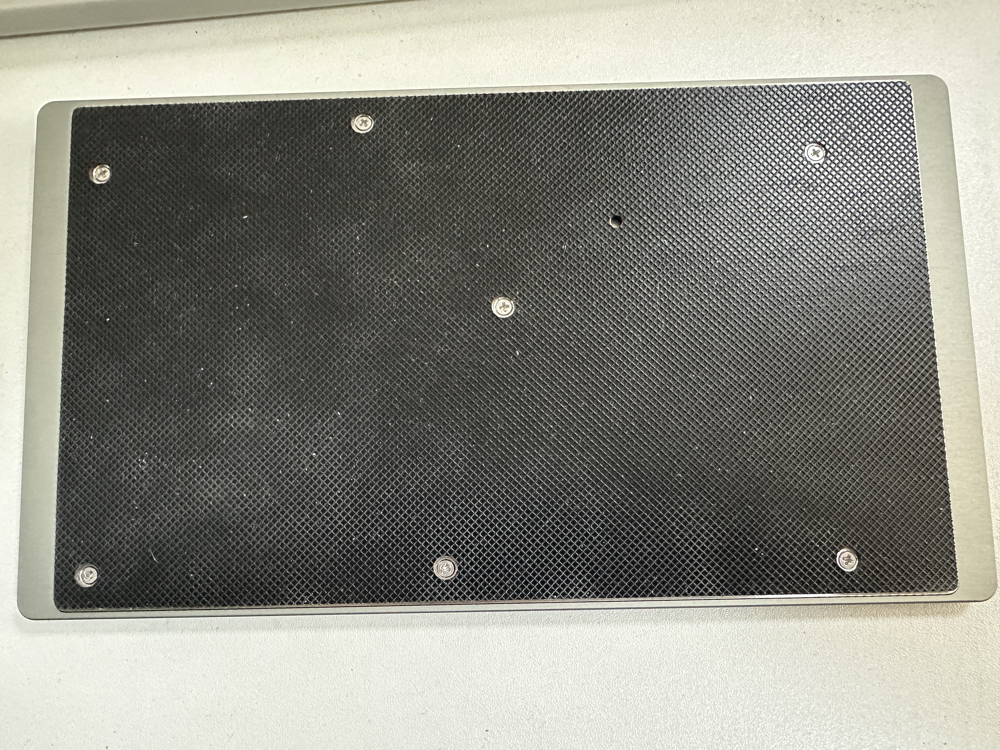
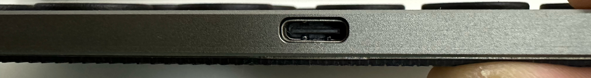
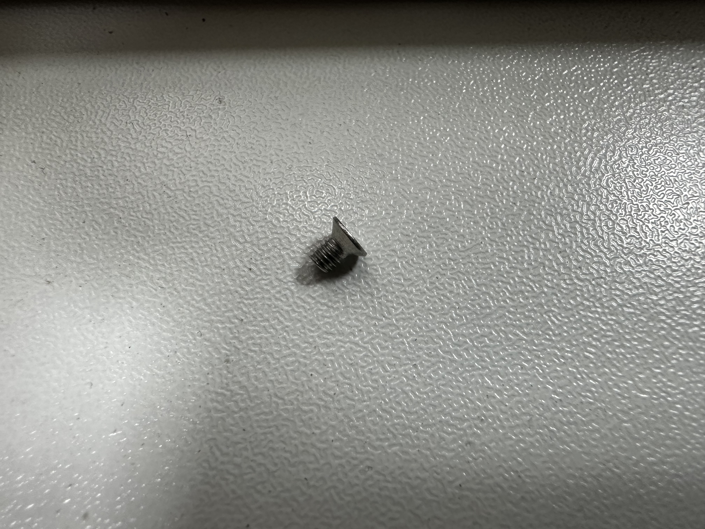
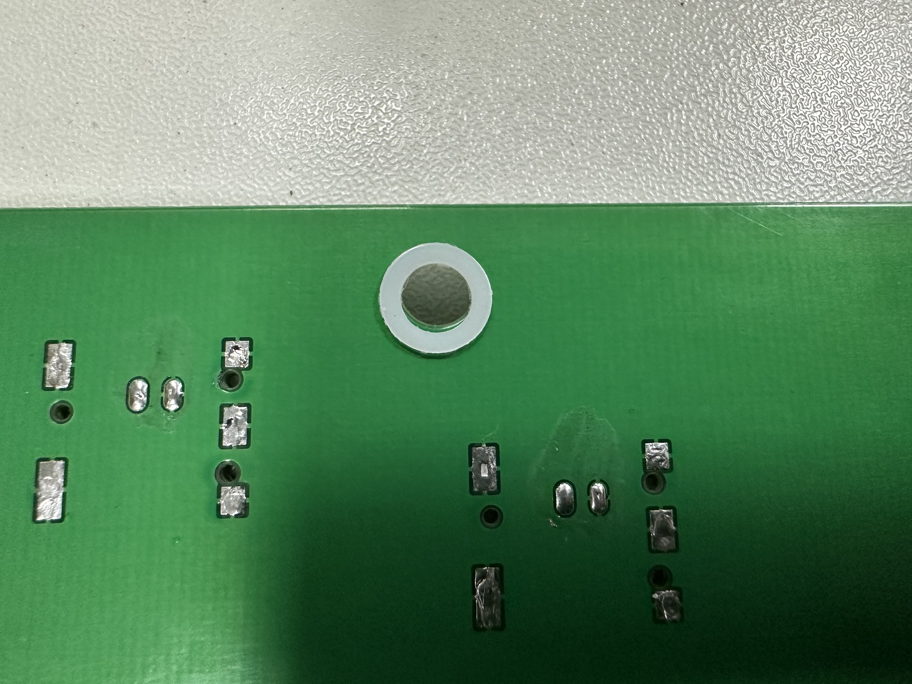
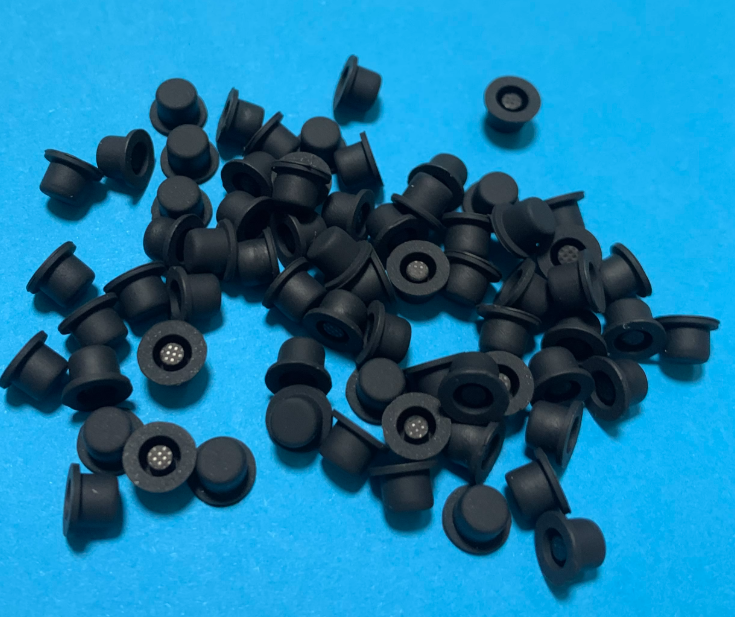
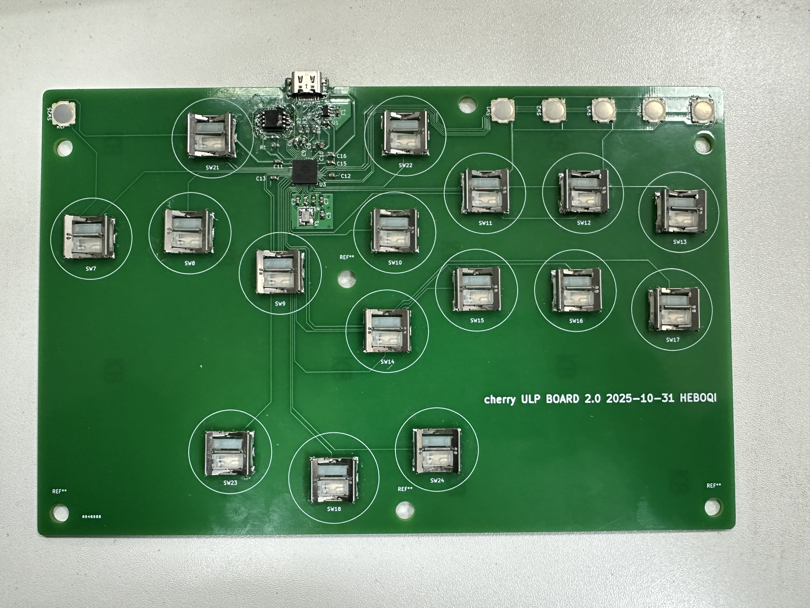
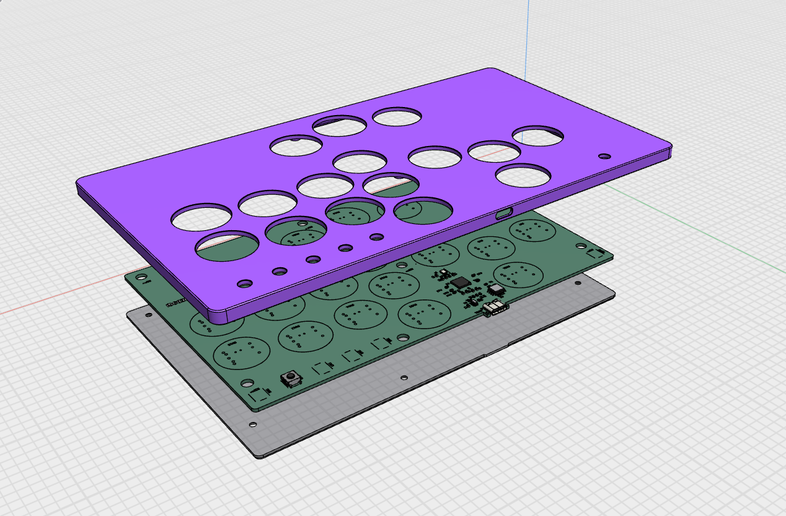

# CHERRY MX 超矮轴格斗键盘

这个图示设备是本人个人化定制， 与项目中的文件略有不同。

正面图

背面图

接口

这是 CHERRY MX 超矮轴格斗键盘的第 2 版（rev2）。在这个版本中，PCB 集成了微控制器和 USB 接口。

你需要准备：

* [CNC上盖](CNC-case/top.step)
* [钣金底盖](CNC-case/bottom.step)
* [防滑垫](CNC-case/anti-slip-rubber.dxf)
* [PCB](pcb/ultra-slim-rev2-gerber.zip) PCB厚度为1.6 mm
* 16个cherry MX ulp超矮轴 [官网链接](https://www.cherry.de/en-gb/products/switches/mx-ultra-low-profile)
* [3D 打印按键帽24](/small_parts/cap_24.stl)
* [3D 打印按键帽26](/small_parts/cap_26.stl)
* 7个M2.5 * 3 沉头螺丝
  
* 7个内径3 厚度0.5的垫圈, 垫在PCB和底盖之间
  
* 6个 底直径：7mm 头直径：5mm 总高：4.8mm 导电：2.5mm的硅胶键帽
  
* 透明胶带, 贴在PCB板焊点反面防止短路

固件方面，你大概率会选择 [GP2040-CE](https://gp2040-ce.info/)。前往[GP2040-CE 下载页面](https://gp2040-ce.info/downloads/)，获取blank版本的UF2 文件, 然后自行修改映射。

刷写固件：用 USB 线将 PCB 连接到电脑，同时按住 BOOT 按键并按下 RESET 按键。此时应出现名为 "RPI-RP2" 的磁盘。将下载的 UF2 文件复制到该磁盘即可。

（当然，如果你愿意，也可以使用任何其他兼容 RP2040 的固件。）

PCB 设计以 [CC BY-SA 4.0](https://creativecommons.org/licenses/by-sa/4.0/) 许可发布。

PCB 设计使用了以下库：

* [Cherry_MX_ULP](https://github.com/pashutk/Cherry_MX_ULP)， 作者 [pashutk](https://github.com/pashutk)
* [Type-C.pretty](https://github.com/ai03-2725/Type-C.pretty)，作者 [ai03-2725](https://github.com/ai03-2725)
* RP2040 库来自 [Hardware design with RP2040](https://datasheets.raspberrypi.org/rp2040/hardware-design-with-rp2040.pdf) 文档中的[极简设计示例](https://datasheets.raspberrypi.org/rp2040/Minimal-KiCAD.zip)
* 项目结构和内容参考了 [Flatbox rev4](https://github.com/flatbox-keyboard/flatbox-rev4)
  
键帽设计参考了以下库：
* [Cherry Ultra Low Profile Keycaps](https://www.thingiverse.com/thing:6058656), 作者 [alescito](https://www.thingiverse.com/alescito/designs)
